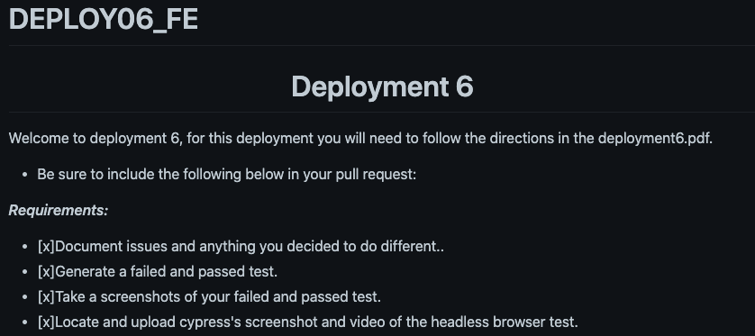

# Deployment 6: EC2s, Agents and Testing

### Objective; Orchestrate 3 EC2s so that one runs Jenkins, one runs a Java app, and one runs the testing suite. Use Jenkins to automate buildilng and testing.

### Step 1: Configuring the EC2s

Install the necessary dependencies on each EC2, and also install the Jenkins plugins that will permit them to work on its agents.

### Step 2: Constructing the Pipeline

Using the pipeline script, build a Jenkinsfile in the repo. Add the two agents to Jenkins, and insert their respective labels into the pipeline.

### Step 3: Find the locations of the various reports

In the `Screenshots` folder, you will find the requested screenshots.

